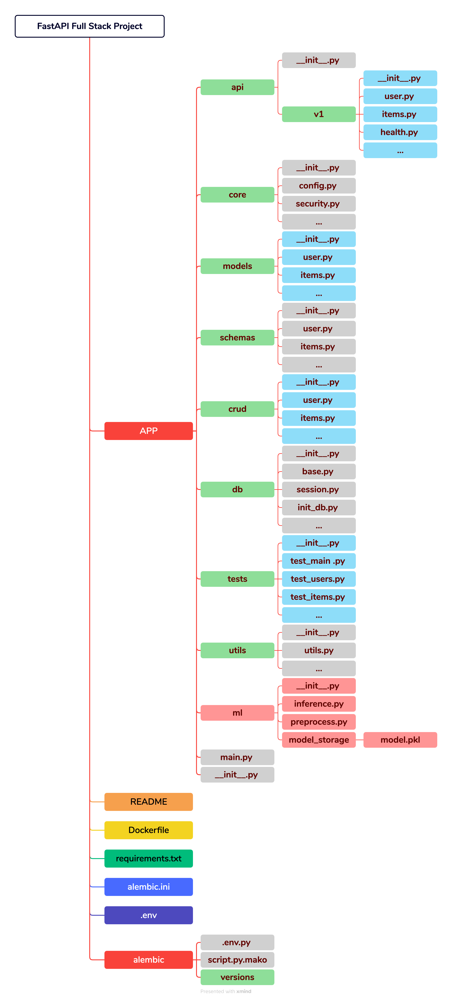

# my-fastapi
fast-api template for practice

The architecture of a full-stack FastAPI project is shown in the [diagram](large_project_architecture.png) above, illustrating a scalable structure with separate components of:

- `main.py`: Entry point of the project, launches the FastAPI application.
- `core/`: Core functionality, including configuration and security.
- `api/`: API routes and views, with version management.
- `models/`: Database models.
- `schemas/`: Data models for request and response validation.
- `crud/`: Database operations (CRUD: Create, Read, Update, Delete).
- `db/`: Database configurations and session management.
- `tests/`: Test files.
- `utils/`: Utility functions and common modules. 
- `ml/`: Machine learning models and utilities. (optional)

**Reference:** 
1. [Full-Stack FastAPI Project](https://fastapi.tiangolo.com/project-generation/)
2. [FastAPI 大型项目架构 (Chinese)](https://www.cnblogs.com/wuhuacong/p/18380808)

However, large-scale monolithic projects built entirely with FastAPI are relatively rare in practice. Typically, FastAPI is used as a microservice component within a broader ecosystem, often integrated with services built on frameworks like Flask, Django, or Spring Boot.

The architecture patterns across these frameworks share similarities. For example:
1. Django's built-in migrations are functionally analogous to Alembic (used with FastAPI/SQLAlchemy).
2. Django's Model system serves a similar purpose to FastAPI's Pydantic models (for data validation) and SQLAlchemy models (for database interaction).

A microservice architecture of FastAPI is much more simpler and usually combined with machine learning models.

 

