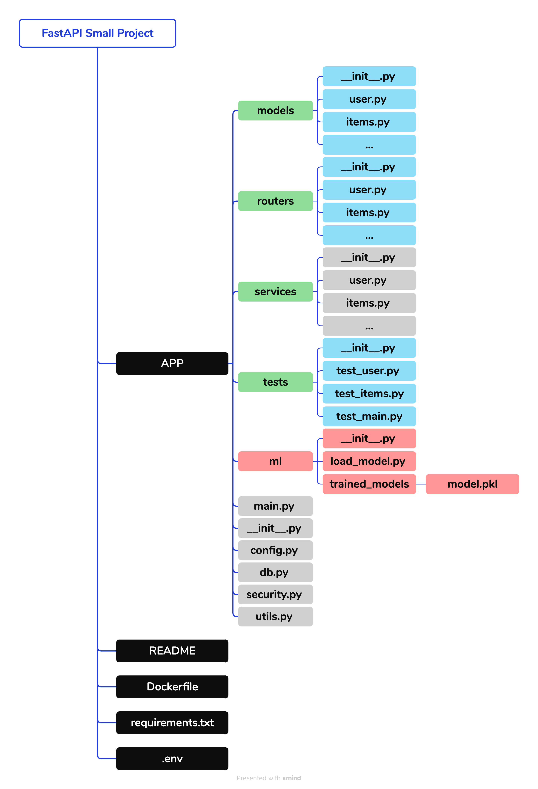

# my-fastapi
fast-api template for practice

## Full-Stack FastAPI Project (large-scale)

The architecture of an example of a full-stack FastAPI project is shown in the diagram above, illustrating a scalable structure with separate components of:

- `main.py`: Entry point of the project, launches the FastAPI application.
- `core/`: Core functionality, including configuration and security.
- `api/`: API routes and views, with version management.
- `models/`: Database models.
- `schemas/`: Data models for request and response validation.
- `crud/`: Database operations (CRUD: Create, Read, Update, Delete).
- `db/`: Database configurations and session management.
- `tests/`: Test files.
- `utils/`: Utility functions and common modules. 
- `ml/`: Machine learning models and utilities. (optional)
- `alembic/`: Alembic migrations for database.

**Reference:** 
1. [Full-Stack FastAPI Project](https://fastapi.tiangolo.com/project-generation/)
2. [FastAPI 大型项目架构 (Chinese)](https://www.cnblogs.com/wuhuacong/p/18380808)

## Comment on the large-scale project
However, large-scale monolithic projects built entirely with FastAPI are relatively rare in practice. Typically, FastAPI is used as a microservice component within a broader ecosystem, often integrated with services built on frameworks like Flask, Django, or Spring Boot.

The architecture patterns across these frameworks share similarities. For example:
1. Django's built-in migrations are functionally analogous to Alembic (used with FastAPI/SQLAlchemy).
2. Django's Model system serves a similar purpose to FastAPI's Pydantic models (for data validation) and SQLAlchemy models (for database interaction).

## Microservice Architecture of FastAPI (small/medium-scale)
Instead of setting every folders for the components, we can simplify the project structure by using one of the following architecture.

## Comment on the microservice architecture
It is worth noting that there is no standard answer for any scale of a FastAPI project. For example, we combine `schemas` and `models` into one module in this example if we don't have complex data validation. However, we can also have a separate `schemas` function module when validation is complicated, especially when we have various data models needed to be validated (e.g., validating the LLM agent status and intermediate response in a long multiple-step task). 

The architecture of the project should be flexible and can be adjusted based on the project's requirements and complexity. 

## Tiny FastAPI Project
For a total new project (e.g. a company's new API service has not been built before), we always start with a tiny scale project and then gradually build it up from tiny scale to small/medium scale then to large scale. Otherwise, building with a large scale project template at the beginning may lead to over-engineering and waste of time. 

We can simply use the `main.py` file to launch the FastAPI application, and then connect the database, enhance the authentication, schema validation, and refactor the function modules and folders as the project grows.

The API can be built with the following steps:
1. **Carify the API design**: e.g. the API endpoints, routes, request/response schema, etc.
2. **Organize the code**: e.g. create the folders and files. We can start with one 'main.py' then refactor the code into multiple files as the project grows.
3. **Error handling**: add error handling for the API.
4. **Testing**: add the test for the API.
5. **Refactoring**: refactor the code to improve the readability and scalability.
6. **Deployment**: docker, GitHub Actions, etc.

## Example of Tiny FastAPI Project

